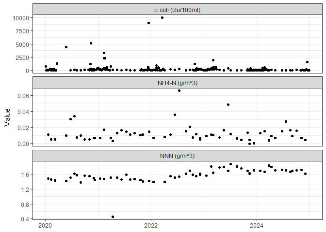
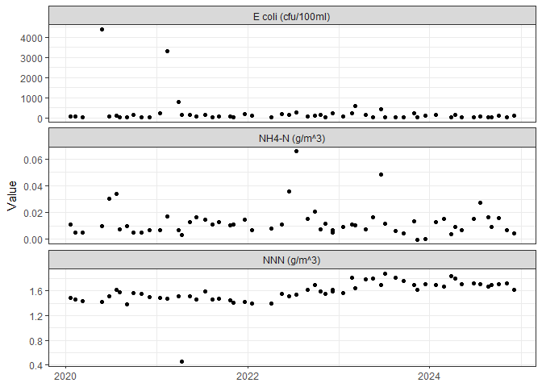
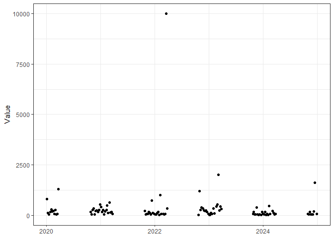

BOPRC R Tutorial 2 - Introduction to internal packages
================
James Dare
2025-04-29

## Getting started with R

The main packages that are used in this tutorial are:

- **BoPRC2022**
- **aquarius2018**
- **tidyverse**
- **lubridate**

Before attempting to install these packages, make sure your Primary CRAN
Repository is set to:

- “New Zealand \[https\] - University of Auckland”.

To check this, click ‘Tools’ –\> ‘Global Options’ –\> ‘Packages’. Click
‘Change’ if you need to adjust this.

You can download most packages by clicking on the ‘Install’ button on
the ‘packages’ tab in the lower right window pane. Then in the Install
Packages popup, select ‘Repository (CRAN)’ from the ‘Install from’ drop
box and type the name of the package you wish to download (e.g., dplyr).

The BOPRC2022 and the aquarius2018 packages are not publicly available
(i.e., they are only used by BOPRC) so they are installed in a slightly
different way. The most recent version of these packages has been stored
on the ‘R Packages and Training’ MSTeams channel, under ‘General’ –\>
‘Files’ –\> ‘Packages 2025 Training’. Download these ‘.gz’ files
somewhere where they can be easily accessed.

To install these packages, click on the ‘packages’ tab in the lower
right window pane. Click ‘Install’ and then use the ‘Install from’ drop
box to select ‘Package Archive File’. Navigate to the place where you
saved the two ‘.gz’ files to install them.

Once all packages are installed you can load them using the ‘library’
function:

``` r
library(dplyr)
```

Finally, click on the ‘Packages’ tab in the lower right corner and
ensure there is a tick next to the package you just loaded.

# The Aquarius Package

The Aquarius package includes functions that enable the user to link and
extract data directly from our Aquarius database.

Before we can begin we need to load the aquarius package.

``` r
library(aquarius2018)
```

### Searching for Site Information

We will explore the functionality of the Aquarius package by getting
basic water quality data from a site of interest, let’s say ‘Pongakawa
at SH2’. This function requires the siteID in order to know exactly what
site we are talking about. Sometimes you may have this and can skip the
next step, but in this case we will use the Aquarius package to search
for the correct site ID which is housed in Aquarius (the database)
tables.

Use the function ‘searchlocationname()’ to conduct a wildcard search for
all sites that have ‘Pongakawa at’ in the title. There are quite a few,
so it would pay to save this as a dataframe for easier reference.

``` r
Site_List <- searchlocationnames("Pongakawa at*")
```

Use the ‘view’ function to view the object you just created, or click on
the name ‘SHsites’ in the Data pane on the right.

``` r
View(Site_List)
```

You can click on the headers of the table to sort by any of the column
headings, if that makes things easier. We can see that ‘Pongakawa at
SH2’ is in the 24th row of this data frame.

You can see that the 2nd row in the data frame ‘SHSites’ contains the
site we are interested in. You can alsosee that the 1st column contains
the siteID that we require under ‘IDENTIFIER’.

Site information is stored in a horizontal format, but we can use the R
transpose function to make this more readable.

``` r
# transpose data from the 24th row
head(t(Site_List[3, ]), 5)
```

    ##              2885              
    ## identifier   "GN922883"        
    ## locationname "Pongakawa at SH2"
    ## latitude     "-37.81552"       
    ## longitude    "176.5127"        
    ## easting      "1909225"

``` r
# store the 'siteID' as an object that we can call upon later
SiteID <- Site_List[3, 1]
SiteID
```

    ## [1] "GN922883"

Great, now we know that the siteID is ‘GN922883’ and this value is
stored as the object ‘SiteID’. Now we can move on to the next step.
Note - you can easily circumvent this step by saving important SiteID’s
in your project (e.g., as a comment) or by finding SiteID’s on Geoview.

### The ‘datasets’ Function

Now that we know the siteID of our site of interest, lets find out what
data is available. The ‘datasets’ function will display all datasets
stored under the site.

``` r
# Create an object with all discrete WQ parameters at the site.
Datasets <- datasets(SiteID)
head(Datasets)
```

    ##      Parameter                          DataId LocationIdentifier  Unit
    ## 1 254nm UV Abs 254nm UV Abs.LabResult@GN922883           GN922883   /cm
    ## 2 340nm UV Abs 340nm UV Abs.LabResult@GN922883           GN922883   /cm
    ## 3 440nm UV Abs 440nm UV Abs.LabResult@GN922883           GN922883   /cm
    ## 4 740nm UV Abs 740nm UV Abs.LabResult@GN922883           GN922883   /cm
    ## 5      Al diss      Al diss.LabResult@GN922883           GN922883 g/m^3
    ## 6       Al tot       Al tot.LabResult@GN922883           GN922883 g/m^3
    ##   UtcOffset UtcOffsetIsoDuration TimeSeriesType     Label        RawStartTime
    ## 1        12                PT12H      Reflected LabResult 1999-07-14 11:45:00
    ## 2        12                PT12H      Reflected LabResult 1992-05-27 13:20:00
    ## 3        12                PT12H      Reflected LabResult 1992-05-27 13:20:00
    ## 4        12                PT12H      Reflected LabResult 1992-05-27 13:20:00
    ## 5        12                PT12H      Reflected LabResult 2020-07-22 13:16:00
    ## 6        12                PT12H      Reflected LabResult 1994-12-15 08:20:00
    ##            RawEndTime                         UniqueId        LastModified
    ## 1 2025-04-14 14:27:00 50a9a5dbe1d7401b967845258aeab055 2025-04-16 23:00:39
    ## 2 2025-04-14 14:27:00 7b5526c093024f4983d583c63172ba66 2025-04-16 23:00:39
    ## 3 2025-04-14 14:27:00 2f68033d59e2419dacb2dddff8248883 2025-04-16 23:00:39
    ## 4 2025-04-14 14:27:00 afc42227735d4d0282af92e0429e474e 2025-04-16 23:00:40
    ## 5 2021-06-10 13:25:00 35924d01ae664b2782ecb44a92a13989 2022-08-15 15:58:53
    ## 6 2021-06-10 13:25:00 dbb5b0b94f674c85920d0b5b0aa0930d 2022-08-15 15:58:53
    ##   Comment Description Publish ComputationIdentifier ComputationPeriodIdentifier
    ## 1                       FALSE               Unknown                     Unknown
    ## 2                       FALSE               Unknown                     Unknown
    ## 3                        TRUE               Unknown                     Unknown
    ## 4                       FALSE               Unknown                     Unknown
    ## 5                       FALSE               Unknown                     Unknown
    ## 6                       FALSE               Unknown                     Unknown
    ##   SubLocationIdentifier                                      ExtendedAttributes
    ## 1                       d4c291b708d34bed98f9bd9dfd170506, EXPORTTOSOS, PickList
    ## 2                       d4c291b708d34bed98f9bd9dfd170506, EXPORTTOSOS, PickList
    ## 3                       d4c291b708d34bed98f9bd9dfd170506, EXPORTTOSOS, PickList
    ## 4                       d4c291b708d34bed98f9bd9dfd170506, EXPORTTOSOS, PickList
    ## 5                       d4c291b708d34bed98f9bd9dfd170506, EXPORTTOSOS, PickList
    ## 6                       d4c291b708d34bed98f9bd9dfd170506, EXPORTTOSOS, PickList
    ##   Thresholds ParameterId  CorrectedStartTime    CorrectedEndTime NumDataPoints
    ## 1       NULL UV_ABS254_F 1999-07-14 11:45:00 2025-04-14 14:27:00            NA
    ## 2       NULL UV_ABS340_F 1992-05-27 13:20:00 2025-04-14 14:27:00            NA
    ## 3       NULL UV_ABS440_F 1992-05-27 13:20:00 2025-04-14 14:27:00            NA
    ## 4       NULL UV_ABS740_F 1992-05-27 13:20:00 2025-04-14 14:27:00            NA
    ## 5       NULL      Al_dis 2020-07-22 13:16:00 2021-06-10 13:25:00            NA
    ## 6       NULL      Al_tot 1994-12-15 08:20:00 2021-06-10 13:25:00            NA
    ##            DisplayName
    ## 1  254nm UV Absorbance
    ## 2  340nm UV Absorbance
    ## 3  440nm UV Absorbance
    ## 4  740nm UV Absorbance
    ## 5 Aluminum (Dissolved)
    ## 6     Aluminum (Total)

### The ‘LocationWQParameters’ Function

An additional function ‘LocationWQParameters’ provides the display names
of all discrete water quality parameters available at a given site
(i.e., a subset of the Dataset file you created above). The display name
is the name that you see in ‘Aquarius Springboard’ and is the required
input for the AQMultiExtract function, e.g. TN = “N (Tot)”

``` r
# Create an object with all discrete WQ parameters at the site.
AvailableWQParams <- LocationWQParameters(SiteID)
AvailableWQParams
```

    ##  [1] "254nm UV Abs"       "340nm UV Abs"       "440nm UV Abs"      
    ##  [4] "740nm UV Abs"       "Al diss"            "Al tot"            
    ##  [7] "Alkt"               "Anions"             "As diss"           
    ## [10] "As tot"             "ASPM"               "B diss"            
    ## [13] "BOD"                "Ca diss"            "Cations"           
    ## [16] "Cd diss"            "Cd tot"             "CHLA"              
    ## [19] "Cl diss"            "Colour Coef 340nm"  "Colour Coef 440nm" 
    ## [22] "Cr tot"             "Cu tot"             "DIN"               
    ## [25] "DO"                 "DO sat"             "DRP"               
    ## [28] "E coli"             "E coli QT"          "Ent"               
    ## [31] "EPT Taxa Percent"   "F diss"             "FC"                
    ## [34] "Fe tot"             "HCO3 diss"          "Hg tot"            
    ## [37] "K diss"             "Lab Stage"          "MCI Score"         
    ## [40] "Mg diss"            "Na diss"            "NH4-N"             
    ## [43] "Ni tot"             "NNN"                "NO2-N"             
    ## [46] "NO3-N"              "Pb tot"             "pH"                
    ## [49] "QMCI"               "Salinity"           "Salinity (Field)"  
    ## [52] "Se tot"             "Si tot"             "Silica diss"       
    ## [55] "SiO2 diss reactive" "SO4 diss"           "SpC"               
    ## [58] "SpC - field"        "TaxaRich"           "TKN"               
    ## [61] "TN"                 "Tot Coliforms"      "TP"                
    ## [64] "TSS"                "Turbidity NTU"      "V tot"             
    ## [67] "VC - BD"            "VC - BT"            "Water Clarity"     
    ## [70] "Water Temp"         "Zn diss"            "Zn tot"

We can use this list to define the parameters of interest that we want
to extract from the database. Let’s define a parameter list of: E. coli,
Nitrite Nitrate (as N), and Ammoniacal N.

``` r
ParamList <- c("E coli", "NNN", "NH4-N")
ParamList
```

    ## [1] "E coli" "NNN"    "NH4-N"

### The AQMultiExtractFlat Function

This function is arguably the most useful function in the Aquarius
package toolbox. It is used for extracting datasets with multiple sites
and multiple parameters.

The syntax requirements for AQMultiExtractFlat are:

- **sitelist** - a list of site ID’s.
- **params** - a list of parameters as display names.
- **start** - (optional) start date in the format YYYY-MM-DD.
- **end** - (optional) end date in the format YYYY-MM-DD.

In this case the sitelist is a list of one, i.e. SiteID, and the
paramlist is that above. We will analyse data between the 1st January
2020 and the 1st January 2025.

AQMultiExtractFlat will extract the requested data query in long format
and include any metadata that is stored in the database. There is
another function called AQMultiExtract which has the same input
requirements, but outputs data in a wide format (i.e., Parameters will
be columns). The downside to this is that no metadata will be included.

``` r
WQData_Pongakawa <- AQMultiExtractFlat(SiteID, ParamList, start = "2020-01-01", end = "2025-01-01")
head(WQData_Pongakawa)
```

It’s as easy as that. You can save this data to a csv file if you wish.

``` r
write.csv(WQData_Pongakawa, file = "Pongakawa_Data.csv", row.names = FALSE)
```

You might also want to briefly check over the data to ensure that
everything is in order. A simple way to do this is using the ‘tidyverse’
ecosystem. In this case we can pass the object (WQData_Pongakawa) to the
ggplot function to create a plot.

``` r
WQData_Pongakawa %>%
    ggplot() + geom_point(aes(x = Time, y = Value)) + facet_wrap(~Parameter, scales = "free_y",
    nrow = 3) + xlab(NULL) + theme_bw()
```

<!-- -->

We can see that there is something strange in the E. coli dataset, where
the frequency increases over the summer period. This is due to the
collection of additional recreational bathing data at this site between
October and April the following year. We should remove these data from
the dataset if we are planning to run analyses designed for monthly
datasets (e.g., assessment against most NPS-FM attributes or trend
analysis. Luckily recreational bathing data and routine monthly samples
are defined in the ‘qualifiers’ column of a ‘AQMultiExtractFlat’
dataset.

Use the filter function in the tidyverse pipeline below to see what the
data looks like if only ‘routine’ data are included. Note the code below
doesn’t make any changes to the dataset or create any new objects, which
is why tidyverse is great for exploring data.

``` r
WQData_Pongakawa %>%
    filter(Qualifiers == "Routine") %>%
    ggplot() + geom_point(aes(x = Time, y = Value)) + facet_wrap(~Parameter, scales = "free_y",
    nrow = 3) + xlab(NULL) + theme_bw()
```

<!-- -->

This looks much better and we might want to save the filtered data as
‘routine’ dataset.

``` r
Routine_Data <- WQData_Pongakawa %>%
    filter(Qualifiers == "Routine")
```

We could also save the recreational bathing data as a ‘rec bathing’
dataset.

``` r
WQData_Pongakawa %>%
    filter(Parameter == "E coli (cfu/100ml)") %>%
    filter(Qualifiers == "Recreational") %>%
    ggplot() + geom_point(aes(x = Time, y = Value)) + xlab(NULL) + theme_bw()
```

<!-- -->

``` r
Rec_Bathing_Data <- WQData_Pongakawa %>%
    filter(Parameter == "E coli (cfu/100ml)") %>%
    filter(Qualifiers == "Recreational")
```

# The BoPRC2022 package

This package is an updated version of the BoPRC package, mainly used for
water quality data analysis. Most updates will go unnoticed to users
that are familiar with the BoPRC package, as they were not intended to
change functionality. However there are some new functions that will be
introduced at the end of this section that may be of interest. The
intention is to expand this suite as users write or discover functions
that may be useful for other staff. This is a great way to achieve
standardised and auditable outputs for reporting purposes. The options
for future development are unlimited, so make sure you discuss any ideas
you have you have with James.

# National Objective Framework Functions

Reporting against the NOF can be a mundane exercise, and many attributes
are open to interpretation. For this reason we have created several
functions to process large datasets using standardized methodology.
These bandings are consistent with those specified in the National
Policy Statement for Freshwater Management 2020. A full list is included
at the end of this section.

## Guide for using NOF functions

Most of the NOF functions use the same method to obtain results. …….
These functions will subset the data based on the system time of the
users computer, to the applicable timeframe for the attritubute. Eg.
NOFLakesTP will analyse the most recently **completed** 1 year period
from Jun to July.

**Step 1 - Obtaining the data** The first step for using the NOF
functions is to create a dataframe in the correct format. This is done
using the AQMultiExtract function in the AQUARIUS package.

``` r
#creating a list of our sites of interest
Sites<-c("DO406909","GN922883","KL998150")

#creating a list of our parameters of interest
Parameters<-c("NNN","NH4-N","pH")

#creating a dataframe of our sites and parameters (in alphabetical order)
Data<-AQMultiExtractFlat(Sites, Parameters)
```

**Step 2 - Using the function** Once the data has been obtained, simply
enter the data into the function.

``` r
Nitrate_Data <- Data %>% 
  filter(Parameter == "NNN (g/m^3)") %>% 
  select(Site, LocationName, Time, Value)

NOFRiversNO3(Nitrate_Data,start="2020-01-01",end="2025-01-01")
```

NH4-N needs to be adjusted by pH to assess against the NPS. The
following code manipulates the dataset and applies the NOFLakesRiversNH3
function.

``` r
NH4_N_Data <- Data %>% 
  filter(Parameter %in% c("NH4-N (g/m^3)","pH (pH Units)")) %>% 
  select(Site, LocationName, Time, Parameter, Value) %>%
  pivot_wider(names_from = Parameter,id_cols = c("Site","LocationName","Time"),values_from = Value)
    

NOFLakesRiversNH3(NH4_N_Data,start="2020-01-01",end="2025-01-01")
```

### NOF functions and their inputs

Here the function names are listed with the AQUARIUS parameter names
beneath them. The NOF guide should be followed, with these parameters
being extracted using the AQMultiExtract function. Then the new
dataframe being inputted into the function of interest.

- NOFLakesPhytoplankton
  - Chloro a
- NOFPeriphyton
  - Chloro Periphyton
- NOFLakesTN
  - N (Tot)
- NOFLakesTP
  - P (Tot)
- NOFLakesRiversNH3
  - Ammoniacal N
  - pH
- NOFRiversNO3
  - Nirite Nitrate (as N)
- NOFLakesRiversECOLI
  - E coli
- NOFCyanobacteria
  - Total Cyanobacteria
  - Potentially Toxic Cyanobacteria
- NOFRiversDRP
  - DRP
- NOFRiversNO3
  - Nitrite Nitrate (as N)
- NOFRiversSFS
  - Water Clarity

## Problem Statement
Try to write a function that prints "Hello, world!".

<details>
 <summary>Click to see the solution</summary>

```r
# Solution
print("Hello, world!")
```


<!-- ## Tidal Function -->
<!-- In order to find out the tide conditions at a certain time, the TidalFromDate function can be used. This function is programmed with tide prediction data from the Land Information New Zealand website. It will output estimated water level, next tide, and proportion. The estimated water level is calculated using a cos curve between the nearest high, and low tide water levels. The proportion output can be interpreted as 1 = high tide and 0 = low tide. Currently, it can only be used to look at tides in Tauranga, between 2012 and 2024.  -->
<!-- For example, say we wanted to know what the tide conditions were in Tauranga at 8:27am on the 25th of October 2019.  -->
<!-- ```{r, message=FALSE, results='hide'} -->
<!-- #input time into function in "yyyy/mm/dd hh:mm:ss" format -->
<!-- TidalFromDate("2019/10/25 8:27") -->
<!-- ``` -->
<!-- ```{r,echo=FALSE} -->
<!-- kable(TidalFromDate("2019/10/25 8:27")) -->
<!-- ``` -->
<!-- The function has given an estimated water level of 0.784m, a proportion of 0.345 and that the next tide is low. This is shown graphically in the plot below, with the black dot representing our inputted time.  -->
<!-- ```{r, echo=FALSE} -->
<!-- t<-seq(0,6.08,0.1) -->
<!-- x<-0.7*sin(0.9681926*t+0.79557758)+1.1 -->
<!-- df<-data.frame(t,x) -->
<!-- ggplot(df, aes(x=t,y=x))+geom_path(col="blue")+xlab("Time")+theme(axis.text.x = element_blank())+ylab("Water Level (m)")+geom_point(aes(x=3.05,y=0.7)) -->
<!-- ``` -->
<!-- If you have an existing dataframe you wish to get tidal information for, the TidalFromDateDF function can be used. This function modifies a dataframe into the correct format to be used with the TidalFromDate function, and adds extra columns with the tidal information. The outputted values can be interpreted the same way as above.  -->
<!-- ## Other Handy functions -->
<!-- ### Write.Excel -->
<!-- You can easily export this tables and data frames to Excel using the 'Write.Excel' function. How this function works is it will copy the data frame to your clip board, so you can simply paste (CTRL+V) into an Excel workbook. -->
<!-- ```{r message=FALSE, tidy=TRUE, eval=FALSE} -->
<!-- Write.Excel() -->
<!-- ``` -->
<!-- ### The Convert.Columns Function -->
<!-- This function is useful for rapidly converting columns in a data frame to a specific class (e.g. numeric). -->
<!-- Input requirements are: -->
<!-- * __x__ - a dataframe -->
<!-- * __y__ - a string of desired classes that correspond to the columns in x.  Options are currently limited to:  "numeric","character","factor",or "integer". -->
<!-- ```{r message=FALSE, tidy=TRUE} -->
<!-- #create dummy dataframe -->
<!-- df = data.frame(SiteID=as.character(c(paste(10112:10121,rep(c("A","B"),5),sep=""))), -->
<!--                 y = as.character(c(1:10)), -->
<!--                 z = as.character(c(11:20)), -->
<!--                 group=as.character(rep(1:5,2)),year=as.character(c(1995:2004)),stringsAsFactors = FALSE) -->
<!-- #determine the class of each column -->
<!-- sapply(df,class) -->
<!-- ``` -->
<!-- All columns are of class 'character'. -->
<!-- ```{r message=FALSE, tidy=TRUE} -->
<!-- #convert columns to desired results -->
<!-- df <- Convert.Columns(df,c("factor","integer","numeric","factor","integer")) -->
<!-- #recheck classes -->
<!-- sapply(df,class) -->
<!-- ``` -->
<!-- They are now the classes specified above. -->
<!-- ### 'List' functions -->
<!-- There are a variety of functions in the package that will output lists (mostly of AQUARIUS siteIDS) of interest. To use these simply run the function, there are no inputs required: eg -->
<!-- ```{r} -->
<!-- # to get a list of NERMN River sites -->
<!-- NERMN_River() -->
<!-- ``` -->
<!-- The 'list' functions are as follows : -->
<!-- * To output a list of NERMN River siteIDs -->
<!--   + NERMN_River -->
<!-- * To output a list of NERMN Estuary siteIDs -->
<!--   + NERMN_Estuary -->
<!-- * To output a list of NERMN Groundwater siteIDS -->
<!--   + NERMN_Groundwater -->
<!-- * To output a list of NERMN Lake siteIDS -->
<!--   + NERMN_Lake -->
<!-- * To output a list of river bathing siteIDs -->
<!--   + Bathing_River -->
<!-- * To output a list of lake bathing siteIDs -->
<!--   + Bathing_Lake -->
<!-- * To output a list of siteIDs corresponding to biophysical unit -->
<!--   + BPU_List -->
<!-- * To output list of siteIDs with flow data -->
<!--   + Flow_Sites -->
<!-- * To output list of geothermal siteIDs -->
<!--   + Geothermal_Sites -->
